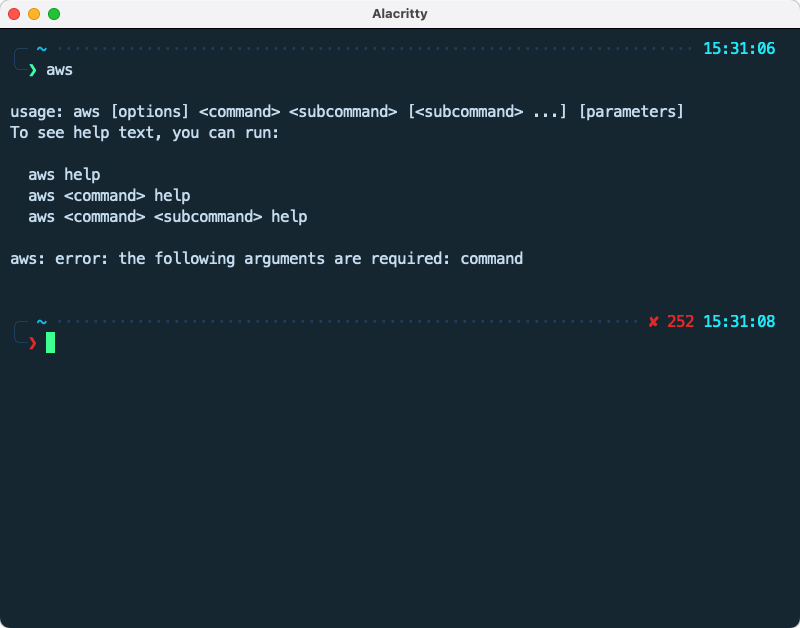
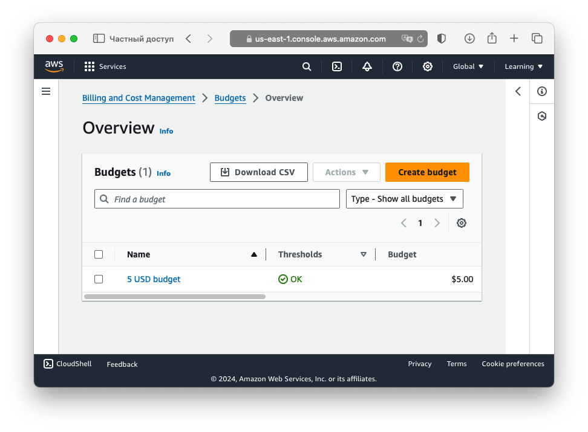
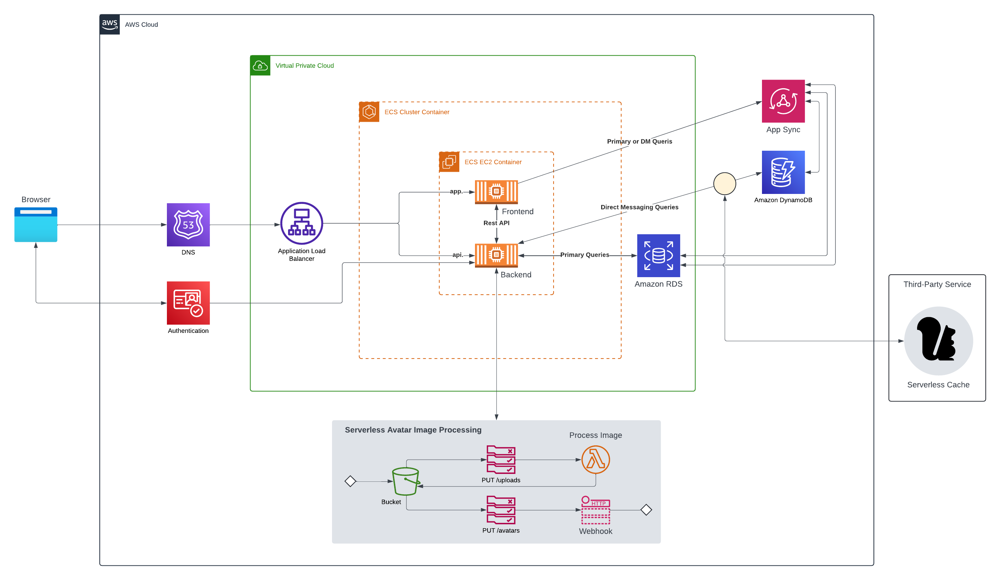

# Week 0 — Billing and Architecture

## Required homework

### Install and Verify AWS CLI

I decided to install AWS CLI on my local machine instead of using Gitpod. I've installed it using Homebrew:
```
brew install awscli
```


### Create a Budget

I created my own Budget for $5 to monitor my spendings.



### Recreate Conceptual diagram


[Lucid Charts Share Link](https://lucid.app/lucidchart/4432a221-4893-42dc-814d-93e709dc2a73/edit?viewport_loc=-735%2C-799%2C2629%2C1212%2C0_0&invitationId=inv_e263d8e9-dcb5-4bdf-84ff-311cb0b9ca51)

### Recreate Logical Architectual diagram



[Lucid Charts Share Link](https://lucid.app/lucidchart/4b660700-f6cb-441f-9aff-29bc59edee1c/edit?viewport_loc=705%2C4%2C1348%2C739%2C0_0&invitationId=inv_b27962db-6cac-46aa-b7d5-4860d8983b59)