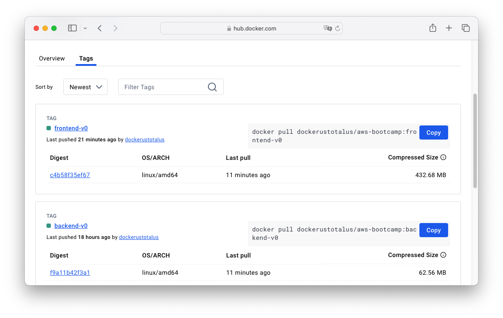

# Week 1 — App Containerization

## Required homework

### Run the Dockerfile CMD as an external script

I've added "command" attribute with value "/frontend-react-js/entrypoint.sh" to Docker Compose file.

### Use multi-stage building for a Dockerfile build
Implementing multi-stage building was as easy as specifying multiple FROM statements in Dockerfile:
```
...
FROM python:3.10-slim-buster AS builder
# Stage 1
...
FROM builder AS dev
# Stage 2
```

### Implement a healthcheck in the V3 Docker compose file
For the backend container I had to install curl inside image, so I've added apt install command in Dockerfile:
```
RUN apt update && apt install -y curl
```
After that I've added healthcheck property in docker-compose.yml
```
healthcheck:
    test: curl -f http://127.0.0.1:4567/api/activities/home
    interval: 30s
    timeout: 5s
    retries: 2
```
As for the frontend container, curl was already installed in the image, so I've simply added this healthcheck property:
```
healthcheck:
    test: curl -f http://127.0.0.1:3000
    interval: 30s
    timeout: 5s
    retries: 2
````

### Tag and push an image to DockerHub
I've created private repository at Docker Hub, tagged and pushed image like that:
```
docker tag aws-bootcamp-cruddur-2023-backend-flask dockerustotalus/aws-bootcamp:backend-v0
docker push dockerustotalus/aws-bootcamp:backend-v0
```


### Launch container in EC2
I've started new EC2 instance, installed Docker the usual way via yum. After that I've run:
```
docker run -p 4567:4567 -d dockerustotalus/aws-bootcamp:backend-v0
```

