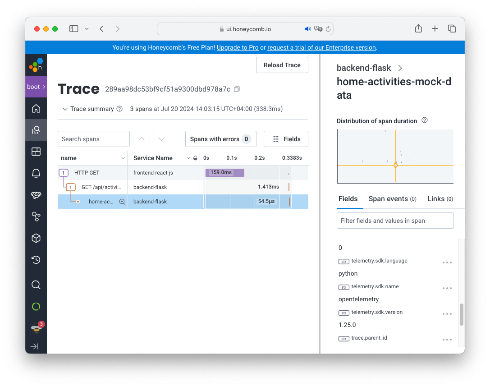

# Week 2 — Distributed Tracing

## Required homework

### Instrument Honeycomb for the frontend-application to observe network latency between frontend and backend
Following [official documentation](https://docs.honeycomb.io/get-started/start-building/web/):
```
// frontend-react-js/src/index.js
import App from './App';
import reportWebVitals from './reportWebVitals';

// If you want to start measuring performance in your app, pass a function
// to log results (for example: reportWebVitals(console.log))
// or send to an analytics endpoint. Learn more: https://bit.ly/CRA-vitals
reportWebVitals();

// Honeycomb
const configDefaults = {
  ignoreNetworkEvents: true,
  propagateTraceHeaderCorsUrls: [
  /.*127.0.0.1+/g, // Regex to match your backend URLs. Update to the domains you wish to include.
  ]
}
try {
  const sdk = new HoneycombWebSDK({
    // endpoint: "https://api.eu1.honeycomb.io/v1/traces", // Send to EU instance of Honeycomb. Defaults to sending to US instance.
    debug: true, // Set to false for production environment.
    apiKey: process.env.REACT_APP_HONEYCOMB_API_KEY, // Replace with your Honeycomb Ingest API Key.
    serviceName: 'frontend-react-js', // Replace with your application name. Honeycomb uses this string to find your dataset when we receive your data. When no matching dataset exists, we create a new one with this name if your API Key has the appropriate permissions.
    webVitalsInstrumentationConfig: {
      vitalsToTrack: [],
    },
    instrumentations: [getWebAutoInstrumentations({
      // Loads custom configuration for xml-http-request instrumentation.
      '@opentelemetry/instrumentation-xml-http-request': configDefaults,
      '@opentelemetry/instrumentation-fetch': configDefaults,
      '@opentelemetry/instrumentation-document-load': configDefaults,
    })],
  });
  sdk.start();
}
catch (err) {
  console.error(err);
}
```



### Add custom instrumentation to Honeycomb to add more attributes, add a custom span
I've added new span and attribute to notifications_activities.py:
```
from opentelemetry import trace
tracer = trace.get_tracer("notifications.activities")
class NotificationsActivities:
  def run():
    with tracer.start_as_current_span("notifications-activities-mock-data"):
      now = datetime.now(timezone.utc).astimezone()
      span = trace.get_current_span()
      ...
      span.set_attribute("app.result_length", len(results))
      return results
...
```


### Run custom queries in Honeycomb and save them later
I've created new custom query "Request duration by URL" and saved it to "My Queries"

